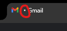

# discreteGPT
Chrome Extension that allows users to provide prompts to and receive responses from ChatGPT through the title of a webpage.

# READ BEFORE USING
<ins>__I (https://github.com/itsvaxx) am not responsible for any consequences that may arise from the use of this software.__</ins> Use this software at your own risk. It is your responsibility to comply with all relevant laws and school policies regarding academic integrity and cheating. If you are caught using this software, it is your sole responsibility to face any consequences that may result. <ins>__By using this software, you acknowledge that you understand and accept these terms.__</ins>

## How to install
1. Download .zip or clone with the git command line tool.
2. Make an account on the [OpenAi website](https://platform.openai.com/api-keys) and generate a token.
3. Create a file in the src directory named `api_key.js`. Paste the following in it -> `const token = "your token here";`
2. Open chrome. Click the three dots in the top right corner -> Extensions -> Manage extensions.
3. Click "Load unpacked" and select the folder you downloaded in step 1. Make sure to enable it.

## How to use
1. To start the script press Ctrl + Shift. You'll know it's working correctly if you see a small dot next to the title of the webpage.

2. Type the prompt that will be asked to the Ai (the title of the webpage should act as your input).
3. Once you are done, press Ctrl + Alt the script will send an API request to the OpenAi endpoint using your prompt.
4. If everything goes well you should see the response to your prompt fill the title field, just as your input did not too long ago.

Note that the responses are kept intentionally brief, as any responses longer than 20+ characters will be too long to fit in the title. 
